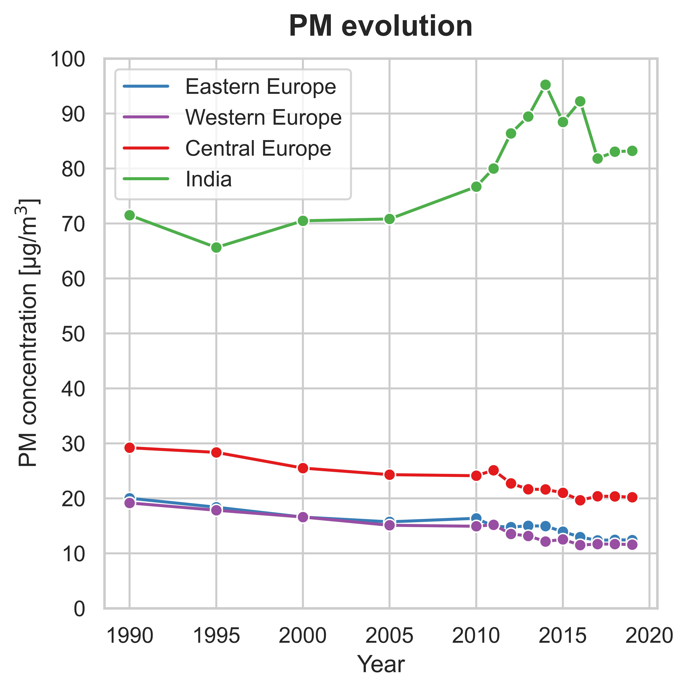
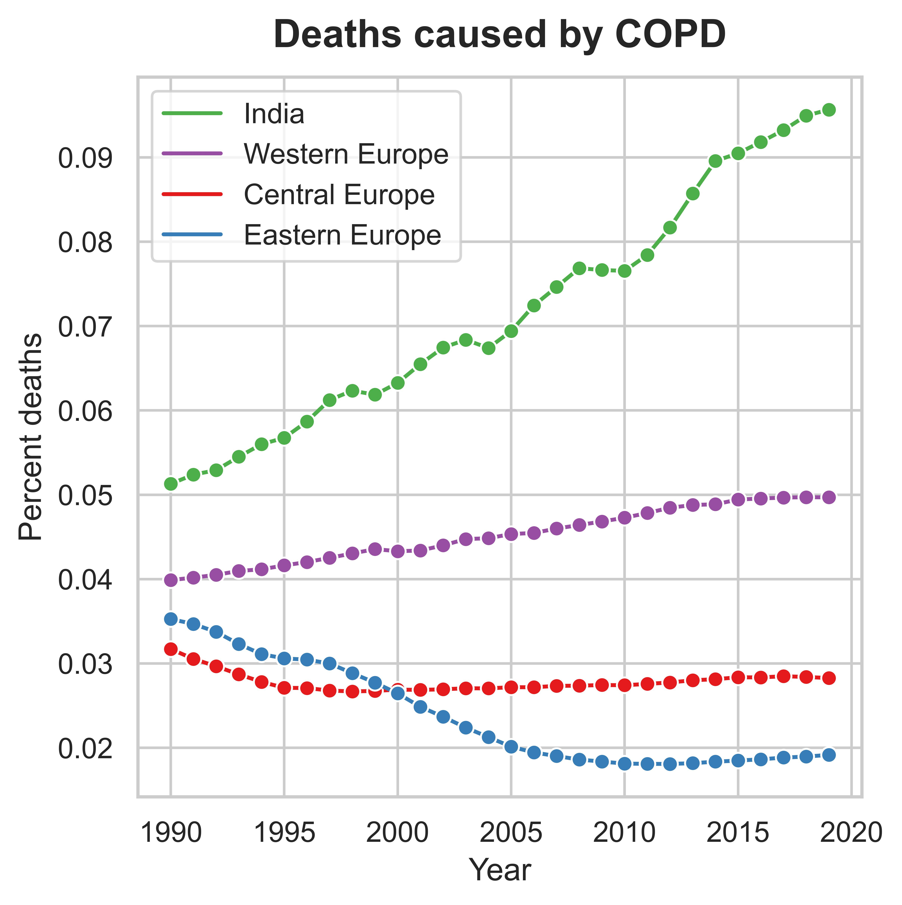
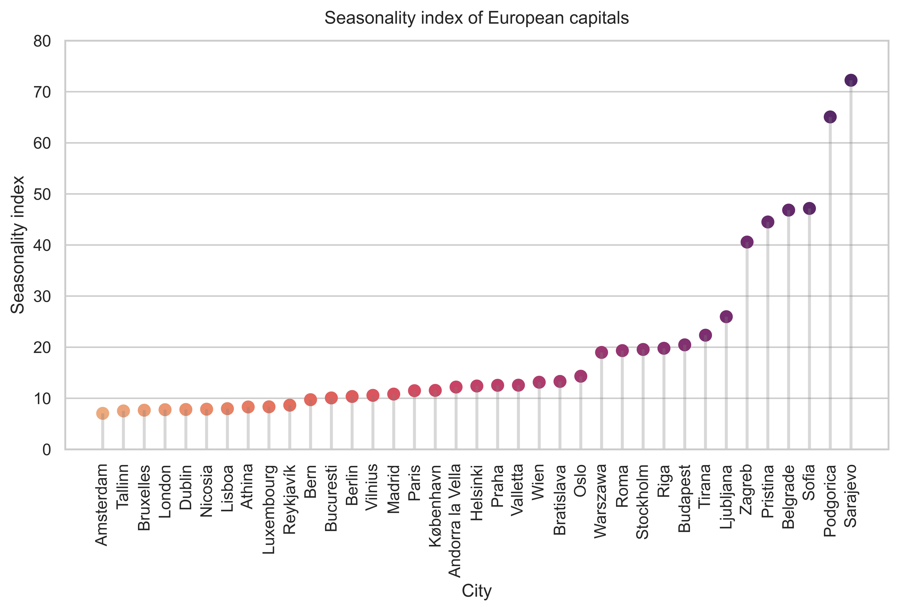
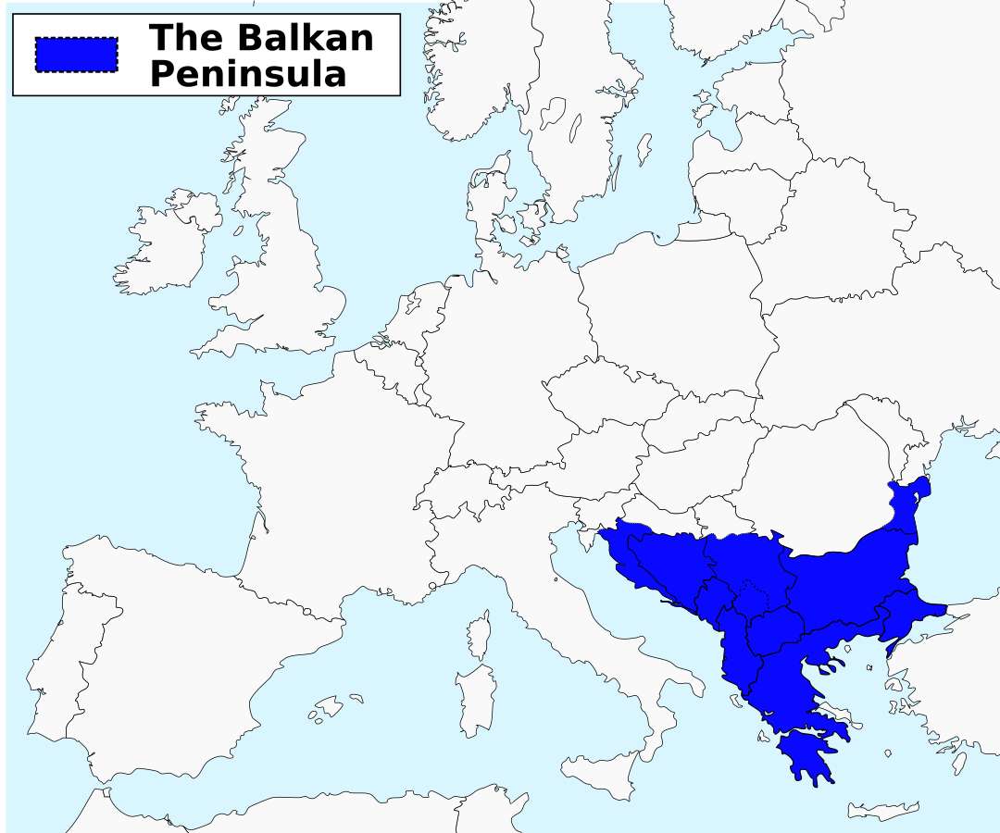
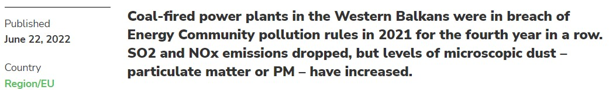

# Plan your trip: Forecasting seasonal pollutants

## In a nutshell
- Data was gathered from all the stations that monitor **Particulate Matter-10 (PM10)** levels for each European capital and that are reported to the [European Environment Agency](https://www.eea.europa.eu/). The records from a total of **318 stations** was used for the analysis.
- The aim was to summarize all this information into an application that would advise the user when is the best time to visit a given city so that **dangerous levels of PM10 are avoided**. It was divided into two modules: PM10 Viewer and PM10 Forecaster.

### With *PM10 Viewer* you can:
1. Visualize PM10 historical data for European capitals.
2. Get the best months (ranked) to visit a certain city.
3. Inspect the levels of PM10 in a given day or period of time. For instance, you could analyze how the lockdowns due to Covid-19 influenced the emissions of PM10 in each city.

### With *PM10 Forecaster* you can:
1. Visualize the forecast of PM10 levels by city using a built-in *generalized* SARIMA model.
2. Interactively change the parameters of SARIMA to fine-tune and optimize the model for each specific city.

**Continue reading to see how the analysis was performed and how the app would retrieve the requested information (gifs below).**

## 1- Context
- Air pollution is responsible for many respiratory and cardiovascular diseases. 
- **Particulate Matter (PM)** are one of the causal agents of such diseases. These particles are not composed of a single pollutant but rather a mixture of many chemical species (solids and aerosols).
- Some are emitted directly from a source, such as construction sites, unpaved roads, fields, smokestacks or fires.
- Most PMs form in the atmosphere as a result of complex reactions of chemicals such as sulfur dioxide and nitrogen oxides, which are pollutants emitted from power plants, industries and automobiles.
- PM are defined by their diameter (d) for air regulatory purposes:
- Those with a d < of 10 microns (PM10) are inhalable into the lungs and can induce adverse health effects, such as [Chronic Obstructive Pulmonary Diseases (COPD)](https://www.who.int/news-room/fact-sheets/detail/chronic-obstructive-pulmonary-disease-(copd)).

#### In Europe, althoguh PM levels have slowly decreased over the years, COPD cases are steadily increasing

  

## 2- Main objectives
- To build an App to visualize PM10 historical data. 

> If PMs follow a seasonal behavior, we could potentially avoid them by not visiting certain cities during specific periods of time.

- To investigate the seasonality of PM10 in Europe.

> Assuming PMs are seasonal, is it the same for all cities in Europe?

- To forecast levels of PM10 in European cities.

## 3- Data processing

- PM data from all capitals of Europe was obtained from the [European Environment Agency](https://www.eea.europa.eu/).
- For each city, the data recorded by the different sensors (dispersed within the city) was averaged based on the time of the recording.
- [Streamlit](https://streamlit.io/) was used as a tool to build the potential App.

## 4- *PM10 Viewer*

### With *PM10 Viewer* you can:
#### 1- Visualize PM10 historical data for European capitals:
    > Thresholds for Air Quality Index are indicated in dashed lines.
    > Seasons are colored for an easier inspection of seasonality.

#### 2- Get the best months (ranked) to visit a certain city:
    > Returns the average historical concentration of PM10 for that month.
    > Returns the Air Quality Index gradually colored.

#### 3- Inspect the levels of PM10 in a given day or period of time:
    > By specifying the date(s) in the 'From' and 'To' widgets.

## 5- Analysis of seasonality
In order to analyze seasonality, a **Seasonality Index** metric was calculated as follows:
    - Data was grouped by year and month
    - Seasonality Index (SI) = max(conc.) - min(conc.)
    - Thus, the higher the SI, the higher seasonality is expected.

The *Seasonality Index* for each city was plotted in a map using the respective country geocoordinates. It was found that the cities with the highest seasonality index were **geographically related** and corresponded to the Balkans.

  

The Balkans accumulate most of Europe's power plants and households do depend on carbon, which seems to be reflected in the seasonality index.

## 6- *PM10 Forecaster*

### With *PM10 Forecaster* you can:

#### 1- Visualize the forecast of PM10 levels by city using a built-in *generalized* SARIMA model.
    > Generalized model: SARIMA(0,1,1)(0,1,2)12
    > In blue: the actual data.
    > In red: the model.
    > In green: the tested data used to calculate the error of the model (RMSE).

#### 2- Change the parameters of SARIMA to fine-tune the model for the city.
    > Fine-tune the trend and seasonal order parameters of SARIMA(p,d,q)(P,D,Q)s to find the best fit for the city.
    > Compare the RMSE of your model to the built-in one.

