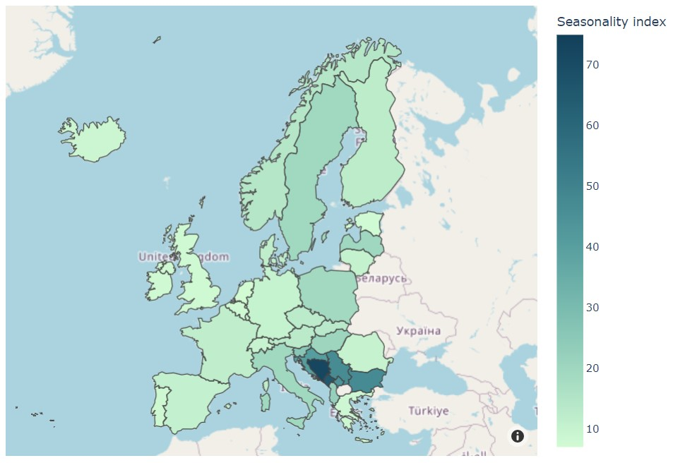

# Plan your trip: Forecasting seasonal pollutants

## 1- Context
- Air pollution is responsible for many respiratory and cardiovascular diseases. 
- **Particulate Matter (PM)** are one of the causal agents of such diseases. These particles are not composed of a single pollutant but rather a mixture of many chemical species (solids and aerosols).
- Some are emitted directly from a source, such as construction sites, unpaved roads, fields, smokestacks or fires.
- Most PMs form in the atmosphere as a result of complex reactions of chemicals such as sulfur dioxide and nitrogen oxides, which are pollutants emitted from power plants, industries and automobiles.
- PM are defined by their diameter (d) for air regulatory purposes:
- Those with a d < of 10 microns (PM10) are inhalable into the lungs and can induce adverse health effects, such as [Chronic Obstructive Pulmonary Diseases (COPD)](https://www.who.int/news-room/fact-sheets/detail/chronic-obstructive-pulmonary-disease-(copd)).

#### In Europe, althoguh PM levels have slowly decreased over the years, COPD cases are steadily increasing

  

## 2- Main objectives
- To build an App to visualize PM10 historical data. 

> If PMs follow a seasonal behavior, we could potentially avoid them by not visiting certain cities during specific periods of time.

- To investigate the seasonality of PM10 in Europe.

> Assuming PMs are seasonal, is it the same for all cities in Europe?

- To forecast levels of PM10 in European cities.

## 3- Data processing

- PM data from all capitals of Europe was obtained from the [European Environment Agency](https://www.eea.europa.eu/).
- For each city, the data recorded by the different sensors (dispersed within the city) was averaged based on the time of the recording.
- [Streamlit](https://streamlit.io/) was used as a tool to build the potential App.

## 4- *PM10 Viewer*

<*under construction*>

## 5- Analysis of seasonality
In order to analyze seasonality, a **Seasonality Index** metric was calculated as follows:
    - Data was grouped by year and month
    - Stationality Index (SI) = max(conc.) - min(conc.)
    - Thus, the higher the SI, the higher the seasonality

The *Seasonality Index* for each city was plotted in a map using the respective country geocoordinates. It was found that the cities with the highest seasonality index were **geographically related** and corresponded to the Balkans.

 
 

The Balkans accumulate most of Europe's power plants and household do depend on carbon, which seems to be reflected in the stationality index.

## 6- *PM10 Forecaster*

<*under construction*>